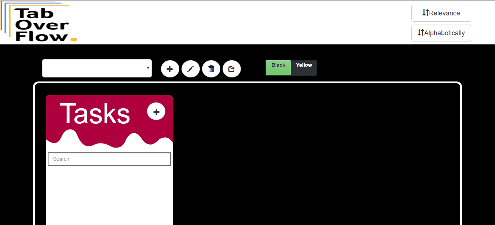

# Tab-Overflow

## Basic Features:   
- Login and SignUp   
- Add Activities   
- Add Tasks inside activities   
- Add URLs inside Tasks  
- Search, Rename, Delete Activities  
- Search, Rename, Delete Tasks 
- Display Tabs Opened Currently in the Browser (Real-Time) 

## A little preview

## Add-Ons:    
- Sorting tabs    
  - By Relevance (Using Artificial Neural Networks)    
  - Alphabetically
- Dark Mode for better readability   
- Share Activities 
- Share Tasks

## Contributors:   
- @amitmahajan29  
- @akshay2102    
- @atharvagole   
- @harshaldedhia   
- @Ye11ow-Flash    
