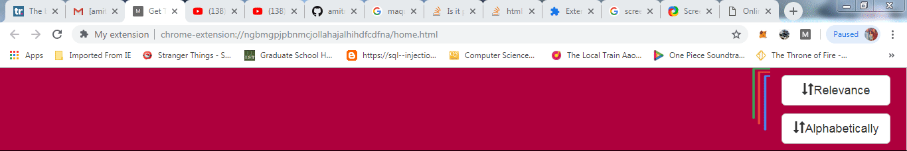
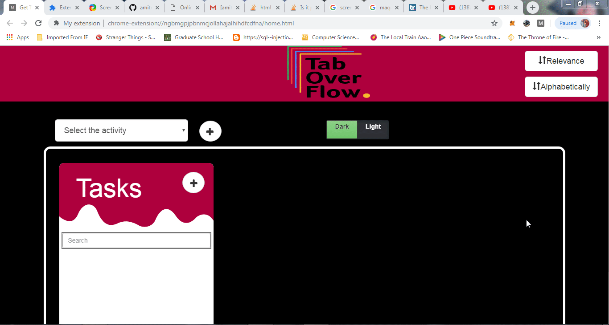
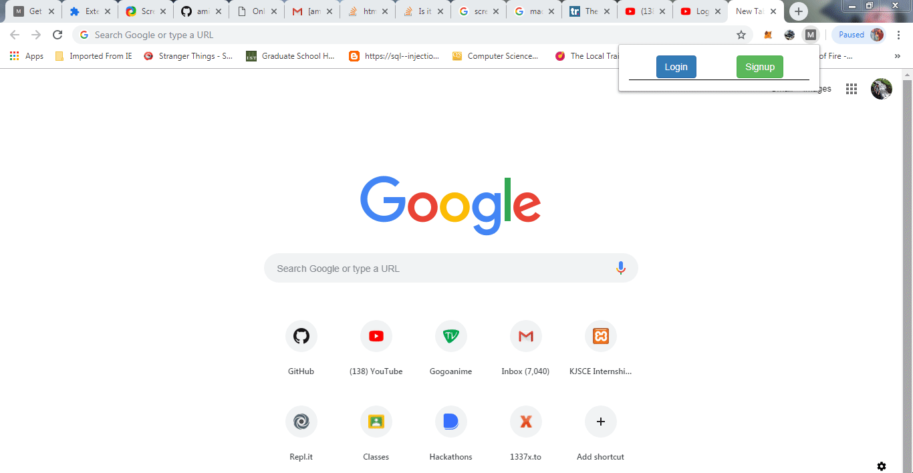

# Tab-Overflow

## Basic Features:   
- Login and SignUp   
- Add Activities   
- Add Tasks inside activities   
- Add URLs inside Tasks  
- Search, Rename, Delete Activities  
- Search, Rename, Delete Tasks 
- Display Tabs Opened Currently in the Browser (Real-Time) 

## Sorting:

## Over-view:

## Login:

## Add-Ons:    
- Sorting tabs    
  - By Relevance (Using Artificial Neural Networks - for training, we created our own dataset)    
  - Alphabetically
- Dark Mode for better readability   
- Share Activities 
- Share Tasks

## Future Work:
- Improving GUI
- Adding user friendly features like "Delete All" & "Save All" buttons
- Adding collaborators

## Contributors:   
- [@amitmahajan29](https://github.com/amitmahajan29)  
- [@akshay2102](https://github.com/akshay2012)    
- [@atharvagole](https://github.com/AtharvaGole)   
- [@harshaldedhia](https://github.com/harshaldedhia)
- [@Ye11ow-Flash](https://github.com/Ye11ow-Flash) 
